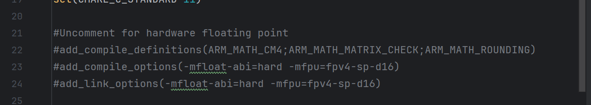
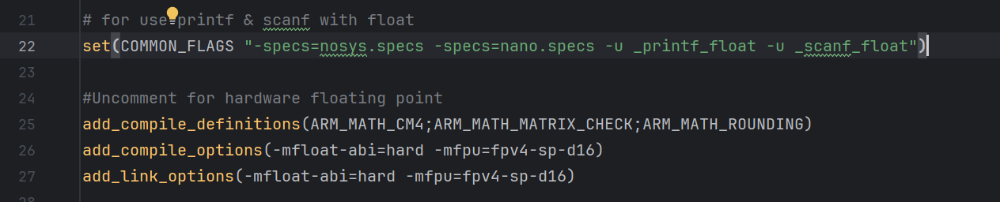
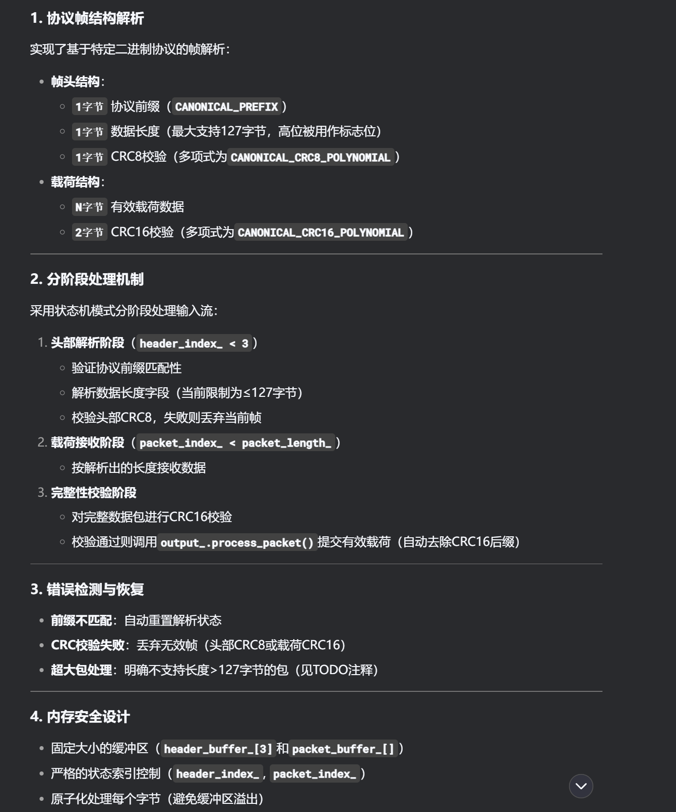
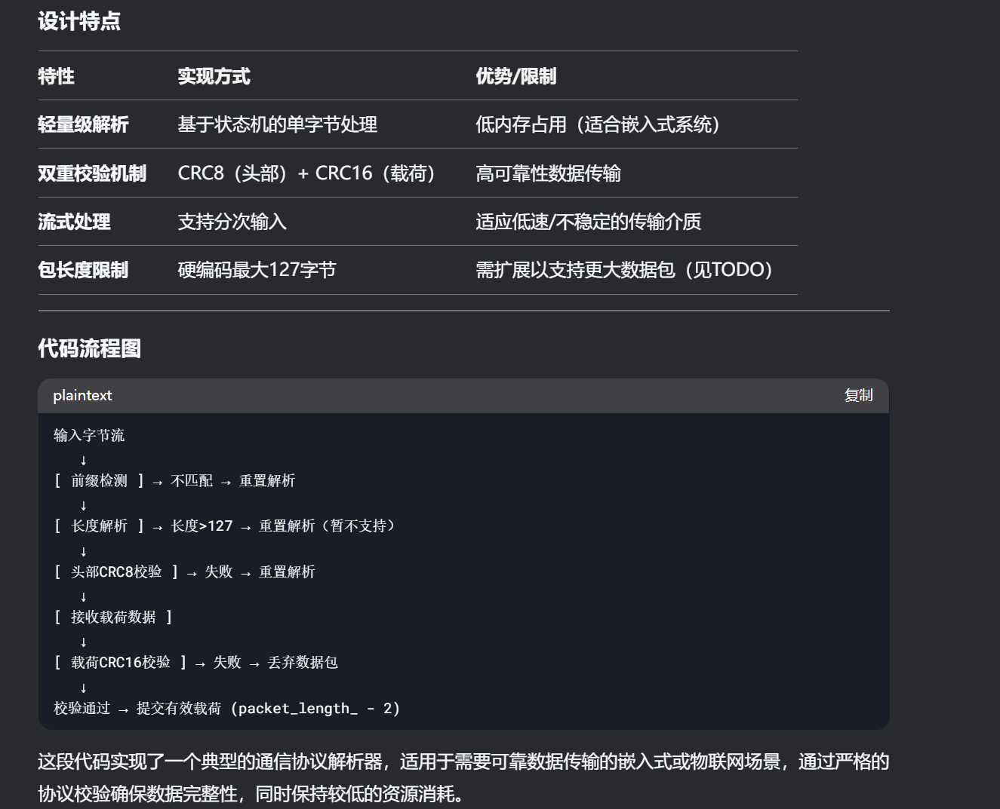

# dummy_learn

创建工程时钟树记得选择HSE

因为要用freertos，所以timebase source要选tim

安全性：adc要选temperature sensor channel 读取内部温度传感器

带内部参考电压（VREFINT）校正的STM32 DMA 内置温度采集

adc惯例选择规则组，惯例选完adc要重配时钟树

tim encoder mode input filter ?

tim10自动装载开了，tim11没开？

spi1中断开了，spi3没开？

注意usrt4的RX dma是circular

freertos选择ENABLE_FPU，各参数配置

生成界面修改Linker Settings

软件版本：cubemx:6.14.0 keil:5.2.4 pack:2.17.1

如何开启freertos的main任务？主任务已经转移到freertos.c里了

原版：在adc.c里添加了初始化步骤

在main.c里有uid的初始化

使用freertos的FPU要修改makefile:

注意每次重新生成代码都会覆盖cmakelists

我的板用的12M晶振，原理图是8M

main.c里有uuid，在usbd里有用，用处不明

UsbDeferredInterruptTask任务的作用？

原版在adc.c和tim.c中有功能实现，但都没用到

### InitCommunication()

protocol.hpp参考https://github.com/samuelsadok/fibre/tree/devel 开源通讯框架 没看懂

串口数据解析：

usb，串口，can都是继承的同一个stream，协议区别？

USBD_CDC_ReceivePacket？

### dummy.Init()
can长度？